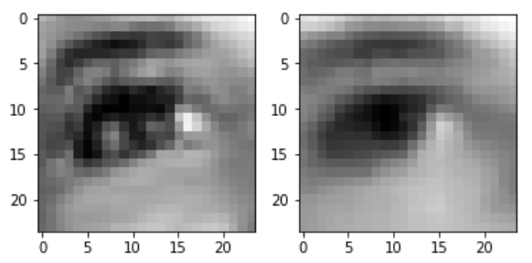
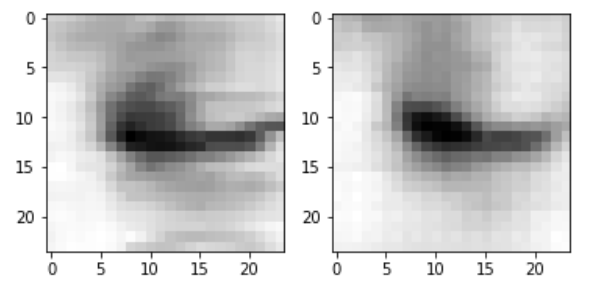

## Few-shot eye classification

Dmitrii Khizbullin, 2021

The solution is trained in two stages. Stage one is completely unsupervised variational autoencoder trained on all 3600 images. Reconstruction loss is L2 error, KL-divergence loss is imposed on means and log-variances produced by the encoder, the latent vector is of size 50. The purpose of VAE is to reduce dimentionality of images to avoid overfit during classification.





The second stage is supervised classification on a manually annotated 100 samples (50 open and 50 closed eyes). 50 samples go to training, 50 go to validation. Validation accuracy reaches 94% (compared to 78% without pretraining) suggesting that VAE-based pretraining helps to boost accuracy even for an extremely small dataset.

To create conda environment:
```bash
conda env create -f environment.yml
```

To run training:
```bash
python train.py
```
It produces `vae.pth` and `classifier.pth` artifacts.

To run inference:
```bash
python inference.py test/
```